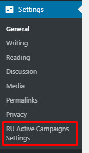
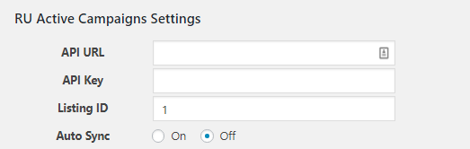
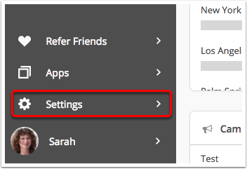
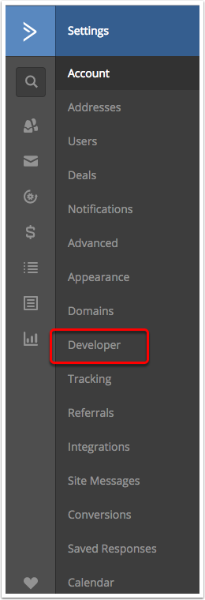
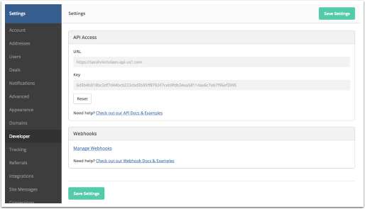

# Registered User Sync Active Camapaign (RUSAC)

## Documentation
#### Contents
* Installing the Plugin
* Setup the plugin with Active Campaign
* Hooks
  * Actions
  * Filters
* Custom Triggers
* Code Samples

## Installing the Plugin
1. Acces the file manager of your WordPress website. 
2. Download the plugin files and extract in the folder registered-user-sync-activecampaign
3. Upload the contents of `/registered-user-sync-activecampaign/` to the `/wp-content/plugins/registered-user-sync-activecampaign/` directory
4. Activate Registered User Sync ActiveCampaign through the 'Plugins' menu in WordPress

## Integrate the plugin with Active Campaign

We provide very easy integration with the active campaign. In order to integrate the Active Campaign we need the API key and API url.

Follow the steps
1. Go to the settings

2. Fill the Active campaign details here.

<small>(Source: <a href="https://help.activecampaign.com/hc/en-us/articles/207317590-Getting-started-with-the-API#how-to-obtain-your-activecampaign-api-url-and-key">Active Campaign Website</a>)</small>
*How to obtain your ActiveCampaign API URL and Key?*

In order to enable an integration between your *ActiveCampaign* account and a *RUSAC plugin*, you will need to first obtain your API URL and Key.

The API URL and Key can be thought of as your username and password to your ActiveCampaign account. When you give this information to a RUSAC Plugin, they will be able to access your account to sync information or perform other tasks.

To obtain your ActiveCampaign API URL and Key, follow these steps:

1. Click the "Settings" option located in the left side navigation menu.

2. The Account Settings menu will appear. Click the "Developer" option.

The Developer Settings page will load and will display your ActiveCampaign API URL and Key. You can copy and paste this information into your RUSAC Plugin.

## Hooks
